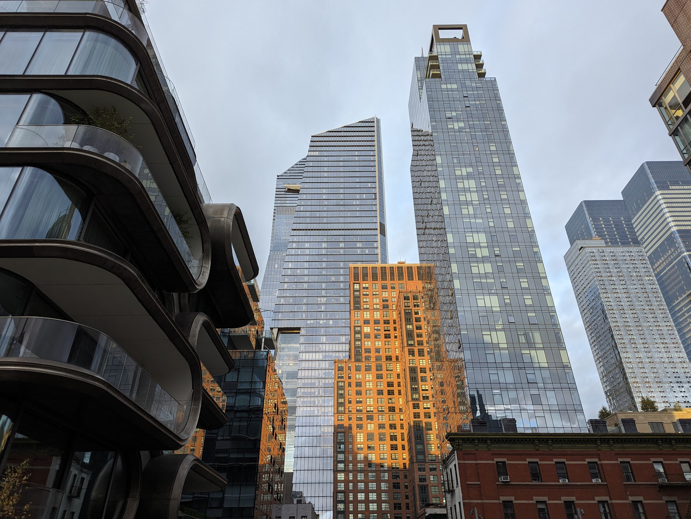

## art
- [MoMA](https://www.moma.org/)
- [Cooper Hewitt, Smithsonian Design Museum](https://www.google.com/maps/place/Cooper+Hewitt,+Smithsonian+Design+Museum/data=!4m2!3m1!1s0x89c258a2492a3fb1:0x2028546238b46dfa)

## comedy
- The Comedy Cellar
- [New York Comedy Club](https://newyorkcomedyclub.com/locations/Midtown)
	- amazing New York cheesecake
- [The Stand](https://thestandnyc.com/)
- [Improv Asylum](https://www.instagram.com/theasylumnyc/)
- [Gotham Comedy Club](https://www.gothamcomedyclub.com/calendar)
- [Broadway Comedy Club](https://www.broadwaycomedyclub.com/)
- [Greenwich Comedy Club](https://www.eventbrite.com/e/free-tickets-to-the-greenwich-village-comedy-club-tickets-166708314055)
- [Eastville Comedy Club](https://www.eastvillecomedy.com/)
- [Comic Strip Live](https://comicstriplive.com/)
* [Caveat](https://caveat.nyc/)

## books
- Housing Works
- [Strand Book Store](http://maps.google.com/?cid=6831339393645709888)
* [The Morgan Library & Museum](https://www.google.com/maps/place/The+Morgan+Library+%26+Museum/data=!4m2!3m1!1s0x89c2590738778edf:0x3ba82e23876af8d)
* [Midtown Comics Times Square](https://www.google.com/maps/place/Midtown+Comics+Times+Square/data=!4m2!3m1!1s0x89c259ab5b625913:0xdd19fcbcd4b219c7)
* [New York Public Library - Stephen A. Schwarzman Building](https://www.google.com/maps/place/New+York+Public+Library+-+Stephen+A.+Schwarzman+Building/data=!4m2!3m1!1s0x89c2590099a8a8a9:0x3b51df6e509a734c)
## food
* Colombus Cafe
* Joe's pizza
* Levain bakery
* [Andy's Deli](http://maps.google.com/?cid=17766427224634360117)
* [A Taste of Katz's](https://www.google.com/maps/place/A+Taste+of+Katz's/data=!4m2!3m1!1s0x89c25a4cb2154dbf:0x2d3b2f258f49ec56)

## music
- The Basement in Queens for techno
- Public Records NYC
- rapture
- Cbjb venue for gigs
* [The Bitter End](https://www.google.com/maps/place/The+Bitter+End/data=!4m2!3m1!1s0x89c25991e800f6dd:0xee7b832042a9f112)
* [Blue Note](https://www.google.com/maps/place/Blue+Note/data=!4m2!3m1!1s0x89c25993d7d5f46d:0x921181beeb4ce349)
* [Village Underground](https://www.google.com/maps/place/Village+Underground/data=!4m2!3m1!1s0x89c25993d6803453:0x6dd14ad780d5a47f)
* [Cellar Dog](https://www.google.com/maps/place/Cellar+Dog/data=!4m2!3m1!1s0x89c2590d490d6185:0x275154937976e8ba)
* [Smalls Jazz Club](https://www.google.com/maps/place/Smalls+Jazz+Club/data=!4m2!3m1!1s0x89c25994686b9ebb:0xa994b5b6ffd1279)

## film
* [Museum of the Moving Image](https://www.google.com/maps/place/Museum+of+the+Moving+Image/data=!4m2!3m1!1s0x89c25f2550f21f03:0x58db958504446c43)
* Cinemas
   * [AMC Lincoln Square IMAX](https://www.imax.com/theatre/amc-lincoln-square-13-imax)
   * [Angelika Film Center - Village East](https://www.angelikafilmcenter.com/villageeast)
## locations & viewpoints
 - Hells kitchen
- Greenwich
- The High Mile elevated footpath through Chelsea
- Pier 66x
- 20 Hudson Yards for highrise view
* [Brooklyn Heights Promenade](https://www.google.com/maps/place/Brooklyn+Heights+Promenade/data=!4m2!3m1!1s0x89c25a3702f50593:0xbe1607c739dedac7)
* [Dumbo](https://www.google.com/maps/place/Dumbo/data=!4m2!3m1!1s0x89c25a316f3eb0fb:0xceb1d92c1cafc9c3)
   * Brooklyn neighbourhood, classic Manhattan Bridge view
* [Staten Island](https://www.google.com/maps/place/Staten+Island/data=!4m2!3m1!1s0x89c245ef79f4d4e7:0x50271f8534babc78)
## other
- Uncommons
- [Maltese centre](https://www.google.com/maps/place/The+Maltese+Center/@40.7803517,-73.9688087,23483m/data=!3m1!1e3!4m6!3m5!1s0x89c25f441659e967:0xded6c7e413ae58e1!8m2!3d40.7714671!4d-73.9196738!16s%2Fg%2F1tcws1h9?entry=ttu&g_ep=EgoyMDI2MDYwMS4wIKXMDSoASAFQAw%3D%3D)
- Roosevelt tram line 
- [Intrepid Sea, Air & Space Museum](https://www.google.com/maps/place/Intrepid+Sea,+Air+%26+Space+Museum/data=!4m2!3m1!1s0x89c2584ed560199f:0x22362b652743ff1)
* [The Feinstein Institutes for Medical Research](https://www.google.com/maps/place/The+Feinstein+Institutes+for+Medical+Research/data=!4m2!3m1!1s0x89c289ca8b61d1f3:0xabf8a4fd7bfc1595)
* NYU