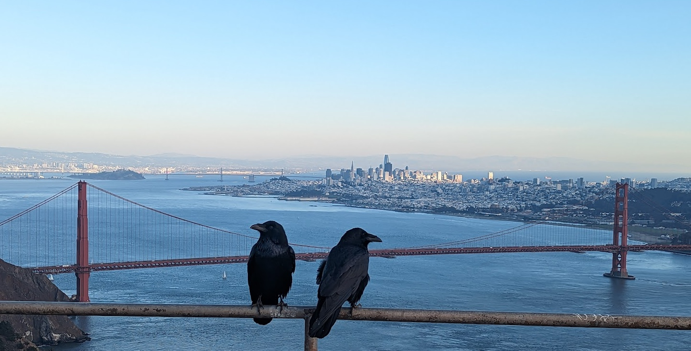

## art

- [Minnesota Street Project](https://minnesotastreetproject.com/)
- [The Lab](https://www.thelab.org/)
- [SF Camera Work](https://sfcamerawork.org/)
- [Haines gallery](https://www.hainesgallery.com)
- North Beach (had checked out Elizabeth Ashcroft's gallery and she was lovely to talk to)
- [Audium](https://www.audium.org): immersive spatial audio experiences
- [Pier 24](https://pier24.org/)
- [San Francisco Museum of Modern Art (SFMOMA)](https://www.sfmoma.org/)

## books
- [Comix Experience](https://www.comixexperience.com/) for comics and graphic novels
- [City Lights Booksellers & Publishers](https://citylights.com/)
- [Books Inc.](https://maps.app.goo.gl/gnRjbJBQszWpHKkh6)
- [Green Apple Books](https://greenapplebooks.com/)
- [Booksmith](http://www.booksmith.com/)
- [Borderlands Books](https://borderlands-books.com/)

## food
- [Tartine Bakery](https://tartinebakery.com/): mouth-watering pastries and sourdough bread 
- [Bi-Rite Creamery](https://maps.app.goo.gl/VC648u9cn9PWrJDj6) had v good ice cream
- In-N-Out Burger: try an "animal style" burger
- [Bean Bag Cafe](https://beanbag.cafe/)

## music
- [Amoeba Music](https://www.amoeba.com/): huge record store 
- [Bottom of the Hill](http://bottomofthehill.com/calendar.html) historical intimate venue for gigs
- Techno: was recommended to check out [F8](https://www.feightsf.com/) and [1015](https://1015.com/)
- [Audium](https://www.audium.org): immersive spatial audio experiences

## locations & viewpoints
- [Twin Peaks](https://maps.app.goo.gl/6ushekrznDvUVbhJ8)
- [Mission Dolores Park](https://maps.app.goo.gl/uiJQ55LMN4AW2K9u9)
- [Nike Missile Control Site SF-87](https://maps.app.goo.gl/skuLigvyQGhpMpq98) pretty sweet views of the city from across the river (as shown in the photo above)
enlisted:true
## other
- [Professor Seagull's Smartshop and Gallery](https://www.sfsmartshop.com/events) for all the psychedelic goodies
- [Cheaper than Therapy](https://cttcomedy.com/) stand-up comedy
- [The American Bookbinders Museum](https://maps.app.goo.gl/JmFDjM8PRFa1R8Bz7)
- Ride in a Waymo One self-driving cab
- Visit the [Maltese American Social Club](https://maps.app.goo.gl/JP2F6xdSQVBGKVY96?g_st=ac) 
